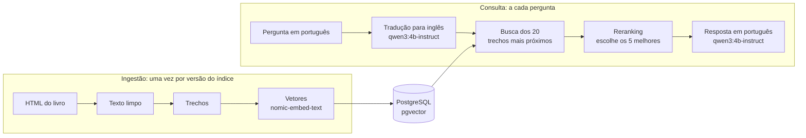

# 📚 RAG Arquitetura

<div align="center">
  
  
  
  
  
  
  
</div>

<br>

> 🎯 **RAG em Java 25, Spring Boot 4 e LangChain4j que responde em português perguntas sobre arquitetura de software**, com os livros da série *The Architecture of Open Source Applications* como fonte, PostgreSQL + pgvector como banco e os modelos rodando na própria máquina pelo Ollama.

Comecei o projeto em 2026 para entender como um RAG funciona por dentro, uma peça de cada vez, e para escrever um artigo medindo quanto cada técnica melhora a resposta. A versão base, a etapa 1 da pesquisa, já responde: o livro está no banco, a busca acha os trechos e o modelo responde em português citando as fontes. As próximas etapas são as técnicas que a pesquisa vai medir.



## 📋 Índice

- [🚀 Como rodar](#-como-rodar)
- [📚 Endpoints](#-endpoints)
- [🔬 Pesquisa](#-pesquisa)
- [📖 Fonte dos dados](#-fonte-dos-dados)
- [🧩 Como o código funciona](#-como-o-código-funciona)
- [🧠 Decisões técnicas](#-decisões-técnicas)
- [🚧 Status](#-status)
- [📄 Licença](#-licença)

## 🚀 Como rodar

Precisa do JDK 25, do Docker e do Python 3. O texto do livro não fica no repositório, então o primeiro passo é baixá-lo. O script usa só a biblioteca padrão do Python e grava as 89 páginas em `data/raw/`:

```bash
python scripts/baixar_aosa.py
```

O `docker-compose.yml` sobe o banco e o Ollama, e baixa os dois modelos na primeira vez (uns 2,8 GB):

```bash
docker compose up -d
```

| Serviço | O que faz | Porta |
|---|---|---|
| `postgres` | PostgreSQL 18 com pgvector, banco `rag`, usuário e senha `rag` (só para uso local) | 5433 |
| `ollama` | Servidor que roda os modelos | 11434 |
| `ollama-modelos` | Baixa o `qwen3:4b-instruct` e o `nomic-embed-text` e termina; modelo já baixado é pulado | - |

O Maven vem pelo wrapper. Se o JDK 25 não for o padrão da máquina, aponte o `JAVA_HOME` para ele antes:

```bash
./mvnw verify
```

No Windows, use `mvnw.cmd`. O `verify` compila, confere a formatação do código e roda os testes, sem Docker, e o `./mvnw spotless:apply` corrige a formatação.

A ingestão lê o livro, gera os vetores e grava os trechos no banco, em uns 15 minutos na CPU. Ela roda no perfil `ingestao`, que sobe a aplicação sem servidor web e termina no fim. Cada execução refaz o índice do zero:

```bash
./mvnw spring-boot:run -Dspring-boot.run.profiles=ingestao
```

Com o banco preenchido, a aplicação sobe a API em `http://localhost:8080`:

```bash
./mvnw spring-boot:run
```

Pela IDE, rode a `RagArquiteturaApplication`, com o perfil ativo `ingestao` para a ingestão ou sem perfil para a API. A configuração vem de variáveis de ambiente, com padrão para o `docker-compose.yml`:

| Variável | Padrão |
|---|---|
| `DB_URL` | `jdbc:postgresql://localhost:5433/rag` |
| `DB_USERNAME` | `rag` |
| `DB_PASSWORD` | `rag` |
| `OLLAMA_URL` | `http://localhost:11434` |

Para ver o resultado da ingestão até onde ela está pronta, rode a classe `InspecionarIngestao` pela IDE, com a raiz do projeto como pasta de trabalho. Ela mostra um resumo no console e grava o texto limpo de cada página em `data/texto/` e os trechos em `data/trechos/`, sem mexer no banco. Com o Ollama no ar, também vetoriza o capítulo do Asterisk e faz uma busca em memória com duas perguntas de exemplo.

## 📚 Endpoints

| Método | Rota | O que faz |
|---|---|---|
| `GET` | `/api/resposta?pergunta=...` | Responde em português com base nos trechos do livro, citando as fontes |
| `GET` | `/api/busca?pergunta=...` | Devolve os 5 trechos do livro mais próximos da pergunta, com a fonte de cada um, sem chamar o modelo |

Pergunta vazia ou ausente volta com 400 nas duas rotas. Na CPU, a resposta leva de 30 segundos a pouco mais de 1 minuto; a busca, menos de 0,1 segundo.

```bash
curl -G http://localhost:8080/api/resposta --data-urlencode "pergunta=What is a channel in Asterisk?"
```

```json
{
  "pergunta": "What is a channel in Asterisk?",
  "resposta": "Em Asterisk, um canal (channel) representa uma conexão entre o sistema Asterisk e um ponto final de telefonia (Figure 1.1). O exemplo mais comum é quando um telefone faz uma ligação para o sistema Asterisk. Essa conexão é representada por um único canal. No código de Asterisk, um canal existe como uma instância da estrutura de dados ast_channel [5].",
  "fontes": [
    {"nota": 0.907, "livro": "The Architecture of Open Source Applications, Volume 1", "capitulo": "Asterisk", "autor": "Russell Bryant", "url": "https://aosabook.org/en/v1/asterisk.html", "posicao": 23, "texto": "..."},
    {"nota": 0.888, "livro": "The Architecture of Open Source Applications, Volume 1", "capitulo": "Asterisk", "autor": "Russell Bryant", "url": "https://aosabook.org/en/v1/asterisk.html", "posicao": 1, "texto": "..."}
  ]
}
```

O número entre colchetes na resposta é a posição do trecho em `fontes`: o `[5]` acima é o quinto, a definição de channel. O exemplo mostra só 2 das 5 fontes.

A `/api/busca` mostra o que o modelo recebe, sem esperar a resposta:

```bash
curl -G http://localhost:8080/api/busca --data-urlencode "pergunta=How does nginx handle many connections at the same time?"
```

```json
{
  "pergunta": "How does nginx handle many connections at the same time?",
  "trechos": [
    {
      "nota": 0.911,
      "livro": "The Architecture of Open Source Applications, Volume 2",
      "capitulo": "nginx",
      "autor": "Andrew Alexeev",
      "url": "https://aosabook.org/en/v2/nginx.html",
      "posicao": 8,
      "texto": "Aimed at solving the C10K problem of 10,000 simultaneous connections, ..."
    }
  ]
}
```

A `nota` vai de 0 a 1 e é calculada pelo LangChain4j como (1 + similaridade de cosseno) / 2: 1 é o mesmo sentido, e 0,5 é nenhuma relação. A `posicao` é a ordem do trecho dentro do capítulo.

## 🔬 Pesquisa

O sistema começa numa versão base e recebe uma técnica por vez. Cada etapa é medida contra a anterior, para mostrar quanto aquela peça contribuiu:

| Etapa | O que muda | Pergunta que responde |
|---|---|---|
| 1. Base | Trechos de tamanho fixo e busca só vetorial | Ponto de partida para comparação |
| 2. Trechos por seção | O livro é cortado nas seções, não por tamanho | Respeitar a estrutura do livro melhora a busca? |
| 3. Busca híbrida | Vetorial mais palavra-chave | Termos exatos, como "NameNode" e "Dialplan", passam a ser encontrados? |
| 4. Tradução da pergunta | A pergunta em português vai para o inglês antes da busca | Traduzir supera buscar direto em português? |
| 5. Reranking | Os trechos encontrados são reordenados antes da resposta | Reordenar compensa um modelo de geração pequeno? |

### 📝 Avaliação

Todas as etapas fazem a mesma prova: uma lista de perguntas em que cada uma anota onde está a resposta certa no livro.

| Pergunta | Resposta está em |
|---|---|
| O que é um channel no Asterisk? | `v1/asterisk`, seção 1.1.1 Channels |
| Como o nginx atende muitas conexões ao mesmo tempo? | `v2/nginx` |
| Como o HDFS evita perder dados quando um disco falha? | `v1/hdfs` |

A nota da etapa é em quantas perguntas o trecho certo apareceu entre os 5 primeiros encontrados.

### 🔎 Primeiros sinais

Antes do banco, fiz uma busca em memória só no capítulo do Asterisk (33 trechos), comparando o vetor da pergunta com o de cada trecho. A definição de channel está no trecho 1:

| Pergunta | Nota do 1º colocado | Trecho 1 (a definição) |
|---|---|---|
| What is a channel in Asterisk? | 0,813 (trecho 23) | Fora dos 3 primeiros |
| O que é um channel no Asterisk? | 0,702 (trecho 3) | 3º lugar, nota 0,688 |

Dois sinais para as próximas etapas. O trecho 1 começa com a introdução do capítulo e só no fim chega à definição, e o vetor dele mistura os dois assuntos, que é o que a etapa 2 (trechos por seção) quer resolver. E a pergunta em português tem notas bem mais baixas que a mesma pergunta em inglês, que é o motivo da etapa 4 (tradução). É uma pergunta só, então é sinal, não resultado.

Com o livro inteiro no banco, pela `/api/busca` (aqui a nota já é a do LangChain4j, de 0 a 1), as três perguntas da avaliação trouxeram os 5 trechos do capítulo certo, entre os 3.982:

| Pergunta | 1º colocado | Os 5 do capítulo certo? |
|---|---|---|
| What is a channel in Asterisk? | 0,907, Asterisk, trecho 23 | Sim, e a definição (trecho 1) entrou em 5º |
| How does nginx handle many connections at the same time? | 0,911, nginx, trecho 8 (o problema C10K) | Sim |
| How does HDFS avoid losing data when a disk fails? | 0,875, HDFS, trecho 22 | Sim |
| O que é um channel no Asterisk? | 0,851, Asterisk, trecho 3 | Sim, e a definição entrou em 3º |

E as respostas do RAG completo, pela `/api/resposta`, com uma quinta pergunta sobre algo que não está nos livros:

| Pergunta | Tempo | Resposta |
|---|---|---|
| What is a channel in Asterisk? | 46 s | Em português, com a definição e citando o trecho dela |
| How does nginx handle many connections at the same time? | 71 s | Em português: workers, eventos, run-loop |
| How does HDFS avoid losing data when a disk fails? | 69 s | Em português: réplicas, checksums e block scanner |
| O que é um channel no Asterisk? | 47 s | Em português, com a definição e citando o trecho dela |
| How does Kubernetes schedule pods? | 32 s | "Não encontrei isso nos livros." |

Conferi no banco duas afirmações que pareciam conhecimento do próprio modelo: as 3 réplicas por padrão do HDFS e a comparação do nginx com o Apache. As duas estão nos trechos enviados. Na primeira versão do prompt, duas das três perguntas em inglês voltaram em inglês: o que resolveu está em [Decisões técnicas](#-decisões-técnicas).

## 📖 Fonte dos dados

Os quatro livros da série [The Architecture of Open Source Applications](https://aosabook.org/en/), publicados em HTML sob a licença Creative Commons Attribution 3.0:

| Livro | Pasta | Capítulos | Conteúdo |
|---|---|---|---|
| AOSA Volume 1 | `v1` | 25 | Arquitetura de sistemas reais |
| AOSA Volume 2 | `v2` | 24 | Arquitetura de sistemas reais |
| The Performance of Open Source Applications | `posa` | 12 | Performance |
| 500 Lines or Less | `500L` | 22 | Sistemas pequenos, com bastante código |

Escolhi essa série porque a licença permite publicar, quem clonar o repositório baixa exatamente a mesma fonte, cada capítulo descreve a arquitetura de um sistema real e o HTML marca capítulo, seção e subseção (`<h1>`, `<h2>` e `<h3>`), o que viabiliza cortar o texto nas seções. Livros comerciais de arquitetura ficaram de fora: nem o texto nem o índice gerado a partir dele poderiam estar num repositório público.

O script baixa 89 páginas, uns 4 MB. Os 83 capítulos e as 4 introduções entram no banco. As 2 bibliografias (`bib1` e `bib2`) ficam de fora: são só listas de títulos de artigos, atrapalham a busca e não respondem nada.

## 🧩 Como o código funciona

```
scripts/baixar_aosa.py     # baixa o HTML cru dos 4 livros e grava o manifesto.json
data/raw/                  # o livro baixado, fora do Git
data/texto/, data/trechos/ # gerados pelo InspecionarIngestao para conferência, fora do Git
docker-compose.yml         # PostgreSQL + pgvector, Ollama e o download dos modelos
src/main/java/br/com/luizmatosdev/ragarquitetura/
├── RagArquiteturaApplication   # ponto de entrada do Spring Boot
├── config/RagConfig            # liga o modelo de embedding ao Ollama e os trechos ao PostgreSQL
├── ingestao/
│   ├── LeitorLivro             # HTML do livro para texto limpo, com livro, capítulo, autor e URL
│   ├── CortadorDeTrechos       # texto em trechos de até 1.200 caracteres
│   ├── IngestaoDoLivro         # o fluxo inteiro: ler, cortar, vetorizar e gravar
│   └── ExecutorDaIngestao      # roda a ingestão ao subir, no perfil ingestao
├── vetor/
│   └── GeradorDeVetores        # trechos e pergunta em vetores de 768 números, pelo Ollama
├── consulta/
│   ├── BuscadorDeTrechos       # os trechos mais próximos da pergunta, direto do banco
│   ├── TrechoEncontrado        # trecho com a nota e a fonte
│   ├── GeradorDeRespostas      # monta o prompt com os trechos e pede a resposta ao modelo
│   ├── BuscaController         # GET /api/busca
│   └── RespostaController      # GET /api/resposta
└── inspecao/
    └── InspecionarIngestao     # roda a ingestão e mostra o resultado de cada parte
```

- **Dois fluxos separados.** A ingestão lê o livro, corta em trechos, gera os vetores e grava no banco, uma vez por versão do índice. A consulta roda a cada pergunta: traduz, busca, reordena e gera a resposta.
- **Download separado da ingestão.** O `baixar_aosa.py` só baixa o HTML, sem limpar nem cortar. O processamento fica na ingestão em Java, e mudar a forma de cortar o texto não exige baixar tudo de novo. O `manifesto.json` registra de onde veio cada página, para a resposta citar a fonte.
- **Texto limpo com a fonte junto.** O `LeitorLivro` transforma cada página num `Document` do LangChain4j: o texto sem a moldura do site (título, propaganda, números das notas) e sem as referências a figuras entre parênteses, como "(Figure 1.1)", e os metadados que identificam de onde ele veio. Os blocos ficam separados por linha em branco, e o código dos exemplos mantém as quebras de linha. No livro inteiro são 87 páginas e 3,6 milhões de caracteres.
- **Trechos que respeitam o texto.** O `CortadorDeTrechos` usa o divisor recursivo do LangChain4j: tenta cortar entre parágrafos, depois entre linhas, frases e palavras, e só parte um parágrafo quando ele sozinho passa do tamanho máximo. Cada trecho herda os metadados da página e ganha o `index`, a posição dele na página. O livro vira 3.982 trechos, com 941 caracteres em média.
- **Vetores pelo Ollama.** O `GeradorDeVetores` recebe um `EmbeddingModel`, a interface do LangChain4j, e não sabe que do outro lado está o Ollama: nos testes, um modelo falso entra no lugar. Os trechos vão em lotes de 32 por chamada, e cada trecho vira um vetor de 768 números. Na CPU, são uns 4,4 trechos por segundo: o livro inteiro levou 15 minutos.
- **Trechos no PostgreSQL.** O `IngestaoDoLivro` junta as peças e grava pelo `PgVectorEmbeddingStore` do LangChain4j, que cria a tabela `trecho` sozinho. Com o livro inteiro, são 3.982 linhas e 21 MB:

| Coluna | Tipo | Conteúdo |
|---|---|---|
| `embedding_id` | `uuid` | Identificador do trecho |
| `embedding` | `vector(768)` | O vetor |
| `text` | `text` | O texto do trecho |
| `metadata` | `jsonb` | Livro, capítulo, autor, arquivo, URL, posição na página e o modelo que gerou o vetor |

- **Busca no banco.** O `BuscadorDeTrechos` transforma a pergunta em vetor, com o prefixo de pergunta, e pede ao store os 5 trechos mais próximos. O PostgreSQL compara o vetor da pergunta com os 3.982 e devolve os mais próximos: na máquina local, a busca leva menos de 0,1 segundo, e a primeira, 1,3 segundo, enquanto o modelo de embedding carrega. O `TrechoEncontrado` tira os tipos do LangChain4j da resposta da API, que fica só com a nota, a fonte e o texto.
- **Resposta com os trechos no prompt.** O `GeradorDeRespostas` busca os 5 trechos, numera cada um com o livro e o capítulo, e manda ao `qwen3:4b-instruct` duas mensagens: as instruções (responder em português, só com base nos trechos, citando o número) e os trechos com a pergunta. O modelo devolve o texto, e a API junta as fontes na mesma ordem dos números. Se a busca não acha nada, a resposta sai sem chamar o modelo.

- **Três modelos, três papéis.** O `nomic-embed-text` transforma texto em vetor de 768 números para a busca. O reranking dá uma nota de relevância a cada trecho encontrado. O `qwen3:4b-instruct` traduz a pergunta e escreve a resposta.

## 🧠 Decisões técnicas

**Java em vez de Python**

Python tem o ecossistema maior para RAG, mas o foco do projeto é a arquitetura, e em Java os contratos entre as peças ficam explícitos nos tipos. O Java é sempre a LTS mais nova, que tem suporte longo e é a versão em que as bibliotecas testam primeiro.

**LangChain4j em vez de Spring AI**

O LangChain4j traz busca híbrida e reranking prontos, que são justamente as etapas da pesquisa. O custo é uma camada a mais para aprender fora do ecossistema Spring.

**PostgreSQL com pgvector em vez de um banco só de vetores**

Texto, metadados e vetores ficam num banco só, e a busca por palavra-chave da etapa 3 usa a busca de texto do próprio PostgreSQL. Qdrant ou Chroma fariam sentido se o foco fosse escala, que não é o caso aqui.

**Modelos locais em vez de API**

O Ollama roda os modelos na própria máquina: sem custo por chamada e sem o texto sair do computador. O custo é velocidade. Desenvolvo numa máquina sem GPU utilizável (i5-12400F, 16 GB de RAM), então tudo roda na CPU, e isso pesou em todas as escolhas de modelo.

**`qwen3:4b-instruct` em vez do `qwen3:4b`**

O `qwen3:4b` padrão pensa antes de responder e ignora o pedido para desligar isso. Na CPU, isso inviabiliza o uso:

| Traduzir uma pergunta | `qwen3:4b` | `qwen3:4b-instruct` |
|---|---|---|
| Tokens gerados | Mais de 1.500, e cancelei | 12 |
| Tempo | Mais de 5 minutos | 7 segundos, 4,6 deles carregando o modelo |
| Velocidade | 5,3 tokens/s | 7,1 tokens/s |

A alternativa era o Gemma 3 4B. Fiquei no Qwen3 porque escreve bem em português e o download é menor.

**Traduzir só a pergunta**

O livro fica em inglês no banco, a pergunta é traduzida para o inglês antes da busca e o modelo responde direto em português. Traduzir o livro inteiro levaria horas na CPU, gravaria os erros de tradução no banco e a citação não bateria mais com o original. Traduzir a resposta de volta custaria mais uma chamada ao modelo por pergunta, e fica como plano B se o português sair ruim. O motivo principal é a busca híbrida: a parte por palavra-chave só funciona se a pergunta e o texto estiverem na mesma língua. Por isso o modelo de embedding não precisa ser multilíngue.

**Trechos de até 1.200 caracteres, com 120 de sobreposição**

1.200 caracteres de texto em inglês dão uns 300 tokens. Sem GPU, o modelo de geração trabalha com 4.096 tokens de contexto, e os 5 trechos da resposta (uns 1.500 tokens) cabem com folga junto da pergunta e das instruções. Trechos maiores levariam mais assunto misturado para cada vetor; menores, perderiam o contexto da frase. A sobreposição repete as frases inteiras do fim do trecho anterior que cabem em 120 caracteres, para que uma ideia cortada no meio apareça completa em pelo menos um dos dois. Os dois números são parâmetros da etapa 1 e podem mudar quando a avaliação mostrar o efeito deles.

**Prefixo que diz ao modelo de embedding o papel do texto**

O `nomic-embed-text` foi treinado com um prefixo que indica o papel do texto: `search_document: ` no que vai ser buscado e `search_query: ` na pergunta. Sem ele, o modelo funciona, mas compara pergunta e trecho como se fossem o mesmo tipo de texto. O prefixo vai só para o modelo: o trecho guardado continua sem ele. O custo é que o prefixo é do `nomic-embed-text`, e trocar de modelo exige revisar isso junto.

**Vetores em lotes de 32 trechos**

Mandar os 3.982 trechos numa chamada só passaria do tempo limite e não mostraria progresso; mandar um por chamada multiplicaria o custo de ida e volta ao Ollama. Com lotes de 32, cada chamada leva poucos segundos na CPU, e o log mostra quantos já foram.

**`PgVectorEmbeddingStore` em vez de tabela própria**

O store do LangChain4j cria a tabela, grava e busca, e já traz a busca híbrida da etapa 3 (vetor mais a busca de texto do PostgreSQL). Com uma tabela própria, criada por migração, eu controlaria cada coluna e cada SQL, mas teria que escrever a busca híbrida na mão. O custo da escolha é que o formato da tabela é do LangChain4j: a coluna se chama `text`, e os metadados ficam num JSON só.

**Metadados em JSONB**

O padrão do store é guardar os metadados como `JSON`. Troquei por `JSONB`, que o PostgreSQL consegue indexar, para filtrar por livro ou capítulo sem ler o texto de cada linha.

**Busca exata, sem índice de vetor**

O pgvector tem índices que aceleram a busca comparando só parte dos vetores (IVFFlat, HNSW), em troca de às vezes deixar o mais próximo de fora. Com 3.982 trechos, comparar a pergunta com todos é rápido, e a busca exata não mistura o erro do índice com o resultado das etapas.

**Índice refeito do zero a cada ingestão**

Cada execução apaga a tabela e grava tudo de novo, para cada etapa da pesquisa medir um índice inteiro feito do mesmo jeito. A tabela só é apagada depois que os vetores novos estão prontos: se a vetorização falhar no meio dos 15 minutos, o banco continua com a versão anterior. O custo é refazer os 15 minutos mesmo quando só uma página muda.

**Ingestão como perfil da aplicação, não como endpoint**

A ingestão roda quando a aplicação sobe no perfil `ingestao`, que liga o `rag.ingestao.executar` e desliga o servidor web, e a aplicação termina no fim. É um processo de 15 minutos que roda raramente, e não faz sentido deixá-lo atrás de uma rota HTTP, onde a requisição ficaria esperando ou precisaria de controle de execução em segundo plano. Sem o perfil, a mesma aplicação sobe a API.

**Store do banco montado só no primeiro uso**

Ao ser montado, o `PgVectorEmbeddingStore` conecta no PostgreSQL e cria a tabela. Com `@Lazy`, a aplicação sobe sem tocar no banco, e o store nasce na primeira busca ou na ingestão. É isso que deixa os testes rodarem sem Docker: os do fluxo usam o store em memória do LangChain4j, que tem a mesma interface, e os da API trocam o buscador por um mock.

**API REST para consultar**

A consulta precisava de uma porta de entrada, e a API é a do Spring que já uso nos outros projetos: dá para testar no navegador ou com `curl`, e a resposta do modelo vira só mais uma rota. A `/api/busca` fica mesmo depois da resposta pronta, porque mostra o que a busca achou sem esperar o modelo escrever, o que ajuda a avaliar as etapas.

**5 trechos por pergunta**

É o número da avaliação (o trecho certo entre os 5 primeiros) e o que cabe no contexto do modelo de geração, com uns 300 tokens por trecho. Fica em `rag.busca.quantidade`. Quando o reranking entrar, na etapa 5, a busca passa a trazer 20 e o reranking escolhe os 5.

**Prompt que prende o modelo aos trechos**

As instruções vão numa mensagem de sistema: responder só com base nos trechos, citar o número de cada trecho usado e, se a resposta não estiver lá, dizer apenas "Não encontrei isso nos livros.". A frase fixa deixa a recusa fácil de reconhecer na avaliação. Na pergunta sobre Kubernetes, que não está nos livros, o modelo recusou em vez de inventar.

**A regra da língua repetida no fim da mensagem**

Na primeira versão, a regra "responda em português" estava só nas instruções do início, e duas das três perguntas em inglês voltaram em inglês: o modelo pequeno segue a língua da pergunta. Repetir a regra no fim da mensagem, logo depois da pergunta, resolveu as cinco perguntas do teste. Isso precisava funcionar antes da etapa 4, em que todas as perguntas chegam ao modelo traduzidas para o inglês.

**Referências a figuras tiradas na leitura do livro, não no prompt**

As respostas copiavam do texto do livro referências como "(Figure 1.1)", e quem lê a resposta não tem a figura. Primeiro tentei pelo prompt, com a regra "não mencione figuras do livro": em 2 de 3 perguntas cujos trechos citavam figuras, a resposta continuou citando. Um modelo de 4B na CPU segue a regra quando ela não briga com o texto que ele tem na frente, e aqui brigava. Então o `LeitorLivro` tira esses parênteses do texto, e o modelo nem vê a referência. O padrão saiu de um levantamento das 122 ocorrências no livro: `(Figure 1.1)`, `(see Figure 10.3)`, `(See Figure 1.11.)`, `(Figure 17.7 and Figure 17.8)`, `(as shown in Figure 6.4)`. Ficaram de propósito os 5 parênteses que dizem mais que a referência, como `(requestStart in Figure 1.1)`, os blocos de código e as legendas das figuras, que descrevem o que a figura mostra. A regra do prompt continua, como reforço. O custo foi refazer a ingestão.

**Temperatura 0,2, contexto de 4.096 tokens e resposta de até 512**

Temperatura baixa deixa o modelo perto do texto dos trechos e com pouca variação entre execuções, o que importa para comparar as etapas. O contexto de 4.096 tokens é o que o Ollama usa na CPU e cabe as instruções, os 5 trechos e a pergunta. O limite de 512 tokens corta respostas que se estenderiam por minutos a 7 tokens por segundo. Os três ficam em `rag.geracao.*`, e o tempo limite da chamada ao modelo é de 5 minutos.

**Resposta por `GET`, como a busca**

Responder não cria nem altera nada, então `GET` com a pergunta na URL descreve bem a operação, e dá para testar no navegador. O custo é que perguntas muito longas esbarram no limite de tamanho da URL, o que não acontece com perguntas de uma ou duas frases.

**Reranking com um modelo pequeno dentro do Java**

Reordenar os trechos com o próprio LLM exigiria uma chamada por trecho, inviável sem GPU. O reranking usa um modelo pequeno feito para isso (ms-marco-MiniLM), executado dentro da aplicação pelo LangChain4j.

**Nome do modelo de embedding gravado com o vetor**

Cada trecho guarda o nome do modelo que gerou o vetor. Vetores de modelos diferentes não se comparam, então trocar de modelo exige refazer o índice, e o nome gravado impede misturar os dois numa busca.

**Docker Compose que aguenta conexão ruim**

O download dos modelos caiu várias vezes no meio. O serviço `ollama-modelos` tem `restart: on-failure:20`, e o Docker tenta de novo sozinho. O `OLLAMA_NOPRUNE` impede o Ollama de apagar o download incompleto ao reiniciar, e a tentativa seguinte continua de onde parou. O PostgreSQL fica na porta 5433 para não disputar a 5432 com um PostgreSQL instalado direto na máquina.

## 🚧 Status

| Parte | Situação |
|---|---|
| Download do livro | ✅ Pronto |
| Banco e modelos no Docker | ✅ Pronto e testado |
| Projeto Spring Boot | ✅ Esqueleto |
| Leitura do livro (HTML para texto limpo) | ✅ Pronto, com testes |
| Corte em trechos (etapa 1: tamanho fixo) | ✅ Pronto, com testes |
| Geração dos vetores | ✅ Pronto, com testes |
| Gravação no banco | ✅ Pronto, com testes |
| Busca (`GET /api/busca`) | ✅ Pronto, com testes |
| Resposta (`GET /api/resposta`): etapa 1 da pesquisa completa | ✅ Pronto, com testes |
| Lista completa de perguntas da avaliação | 🔨 Próxima |
| Etapas 2 a 5 da pesquisa | ⏳ |

## 📄 Licença

O código está sob a licença [MIT](LICENSE). O texto dos livros, baixado pelo script e fora do repositório, pertence aos autores originais e está sob a [Creative Commons Attribution 3.0 Unported](https://creativecommons.org/licenses/by/3.0/legalcode).

---

<div align="center">
  <p>Desenvolvido por <strong>Luiz Matos</strong></p>
  <p>
    <a href="https://github.com/luiz-matos">GitHub</a> •
    <a href="https://www.linkedin.com/in/luizeduardomatos/">LinkedIn</a>
  </p>
</div>
