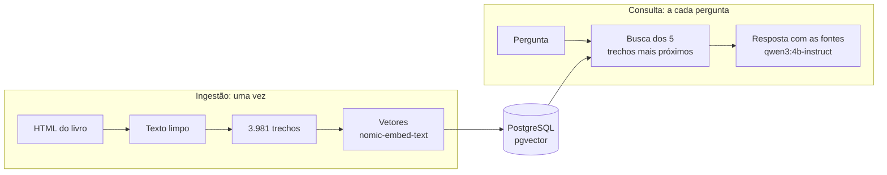

# 📚 RAG Arquitetura

<div align="center">
  
  
  
  
  
  
  
</div>

<br>

> 🎯 **RAG em Java 25, Spring Boot 4 e LangChain4j que responde em português perguntas sobre arquitetura de software**, com os livros da série *The Architecture of Open Source Applications* como fonte e os modelos rodando na própria máquina.

Fiz o projeto em 2026 para entender como um RAG funciona por dentro, construindo uma peça de cada vez. A versão base já responde de ponta a ponta: busca os trechos do livro mais próximos da pergunta e o modelo responde citando as fontes.



## 📋 Índice

- [🎓 O que aprendi](#-o-que-aprendi)
- [🚀 Como rodar](#-como-rodar)
- [🧠 Decisões técnicas](#-decisões-técnicas)
- [🔬 Próximos passos](#-próximos-passos)
- [📄 Licença](#-licença)

## 🎓 O que aprendi

- **RAG são dois fluxos.** A ingestão prepara o livro uma vez: lê, corta em trechos, transforma cada trecho em vetor e grava no banco. A consulta roda a cada pergunta: acha os trechos mais próximos e manda ao modelo junto com a pergunta. O modelo não sabe nada do livro; ele só lê o que a busca entrega.
- **Embedding é proximidade de sentido.** Cada trecho vira um vetor de 768 números, e textos de sentido parecido ficam próximos. Buscar é comparar o vetor da pergunta com os 3.981 do banco. O modelo ainda precisa saber o papel do texto: o `nomic-embed-text` espera `search_document:` no trecho e `search_query:` na pergunta.
- **O corte do texto muda o que a busca acha.** A definição de channel do capítulo do Asterisk ficou fora dos 3 primeiros resultados porque o trecho dela começava com a introdução do capítulo, e o vetor misturava os dois assuntos.
- **Modelo pequeno segue o texto, não a regra.** O `qwen3:4b` padrão pensava antes de responder e levou mais de 5 minutos para traduzir uma frase. O `instruct` respondia em inglês quando a pergunta vinha em inglês, e copiava "(Figure 1.1)" do livro mesmo instruído a não fazer isso. O que resolveu foi trocar de modelo, repetir a regra da língua no fim da mensagem e tirar as referências a figuras na leitura do livro, não pedir com mais ênfase.
- **Rodar local tem custo, e ele pesa em tudo.** Sem GPU, a ingestão leva 15 minutos e cada resposta de 30 segundos a 1 minuto e meio. Foi isso que definiu o tamanho do modelo, o tamanho dos trechos (cabem 5 no contexto de 4.096 tokens) e a decisão de traduzir só a pergunta, não o livro.
- **As interfaces do LangChain4j deixam testar sem infraestrutura.** O código depende de `EmbeddingModel`, `EmbeddingStore` e `ChatModel`, não do Ollama nem do PostgreSQL. Os testes usam um modelo falso e o store em memória e rodam sem Docker.

## 🚀 Como rodar

Precisa do JDK 25, do Docker e do Python 3.

```bash
python scripts/baixar_aosa.py                                # baixa o livro para data/raw
docker compose up -d                                         # PostgreSQL, Ollama e os modelos (2,8 GB)
./mvnw spring-boot:run -Dspring-boot.run.profiles=ingestao   # grava o livro no banco, uns 15 minutos
./mvnw spring-boot:run                                       # sobe a API em http://localhost:8080
```

| Rota | O que faz |
|---|---|
| `GET /api/resposta?pergunta=...` | Responde em português com base no livro, citando as fontes |
| `GET /api/busca?pergunta=...` | Mostra os 5 trechos que a busca achou, sem chamar o modelo |

Os testes rodam com `./mvnw verify`, sem Docker.

## 🧠 Decisões técnicas

| Decisão | Alternativa | Por quê |
|---|---|---|
| Java | Python | O ecossistema de RAG é maior em Python, mas o foco é a arquitetura, e em Java os contratos entre as peças ficam nos tipos |
| LangChain4j | Spring AI | Traz busca híbrida e reranking prontos, que são as próximas etapas |
| PostgreSQL com pgvector | Qdrant ou Chroma | Texto, metadados e vetores num banco só, e a busca de texto do PostgreSQL serve para a busca híbrida |
| Modelos locais no Ollama | API paga | Sem custo por chamada e sem o texto sair da máquina; o preço é a velocidade |
| Livro em inglês, só a pergunta traduzida | Traduzir o livro | Traduzir o livro levaria horas na CPU e gravaria os erros no banco, e a busca por palavra-chave precisa das duas coisas na mesma língua |
| Livros da série AOSA | Livros comerciais | Licença Creative Commons: dá para publicar, e quem clona baixa a mesma fonte |

## 🔬 Próximos passos

Cada técnica entra sozinha e é medida contra a anterior, com a mesma lista de perguntas:

| Etapa | O que muda |
|---|---|
| Trechos por seção | O livro é cortado nas seções, não por tamanho |
| Busca híbrida | Busca por vetor mais busca por palavra-chave, para termos exatos como "NameNode" |
| Tradução da pergunta | A pergunta em português vai para o inglês antes da busca |
| Reranking | A busca traz 20 trechos e um modelo pequeno escolhe os 5 melhores |

## 📄 Licença

O código está sob a licença [MIT](LICENSE). O texto dos livros, baixado pelo script e fora do repositório, pertence aos autores originais e está sob a [Creative Commons Attribution 3.0 Unported](https://creativecommons.org/licenses/by/3.0/legalcode).

---

<div align="center">
  <p>Desenvolvido por <strong>Luiz Matos</strong></p>
  <p>
    <a href="https://github.com/luiz-matos">GitHub</a> •
    <a href="https://www.linkedin.com/in/luizeduardomatos/">LinkedIn</a>
  </p>
</div>
