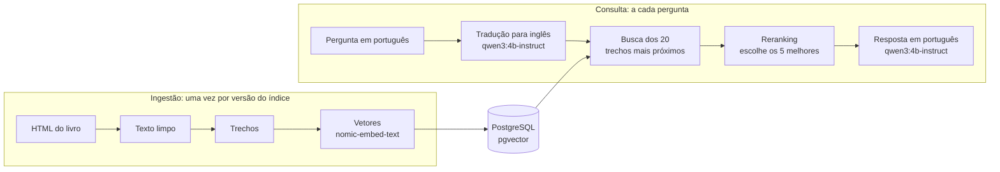

# 📚 RAG Arquitetura

<div align="center">
  
  
  
  
  
  
  
</div>

<br>

> 🎯 **RAG em Java 25, Spring Boot 4 e LangChain4j que responde em português perguntas sobre arquitetura de software**, com os livros da série *The Architecture of Open Source Applications* como fonte, PostgreSQL + pgvector como banco e os modelos rodando na própria máquina pelo Ollama.

Comecei o projeto em 2026 para entender como um RAG funciona por dentro, uma peça de cada vez, e para escrever um artigo medindo quanto cada técnica melhora a resposta. Está em construção: o livro, o banco e os modelos estão prontos e testados, e o RAG em si é a próxima parte.



## 📋 Índice

- [🚀 Como rodar](#-como-rodar)
- [🔬 Pesquisa](#-pesquisa)
- [📖 Fonte dos dados](#-fonte-dos-dados)
- [🧩 Como o código funciona](#-como-o-código-funciona)
- [🧠 Decisões técnicas](#-decisões-técnicas)
- [🚧 Status](#-status)
- [📄 Licença](#-licença)

## 🚀 Como rodar

Precisa do JDK 25, do Docker e do Python 3. O texto do livro não fica no repositório, então o primeiro passo é baixá-lo. O script usa só a biblioteca padrão do Python e grava as 89 páginas em `data/raw/`:

```bash
python scripts/baixar_aosa.py
```

O `docker-compose.yml` sobe o banco e o Ollama, e baixa os dois modelos na primeira vez (uns 2,8 GB):

```bash
docker compose up -d
```

| Serviço | O que faz | Porta |
|---|---|---|
| `postgres` | PostgreSQL 18 com pgvector, banco `rag`, usuário e senha `rag` (só para uso local) | 5433 |
| `ollama` | Servidor que roda os modelos | 11434 |
| `ollama-modelos` | Baixa o `qwen3:4b-instruct` e o `nomic-embed-text` e termina; modelo já baixado é pulado | - |

O Maven vem pelo wrapper. Se o JDK 25 não for o padrão da máquina, aponte o `JAVA_HOME` para ele antes:

```bash
./mvnw verify
```

No Windows, use `mvnw.cmd`. O `verify` compila, confere a formatação do código e roda os testes, e o `./mvnw spotless:apply` corrige a formatação.

## 🔬 Pesquisa

O sistema começa numa versão base e recebe uma técnica por vez. Cada etapa é medida contra a anterior, para mostrar quanto aquela peça contribuiu:

| Etapa | O que muda | Pergunta que responde |
|---|---|---|
| 1. Base | Trechos de tamanho fixo e busca só vetorial | Ponto de partida para comparação |
| 2. Trechos por seção | O livro é cortado nas seções, não por tamanho | Respeitar a estrutura do livro melhora a busca? |
| 3. Busca híbrida | Vetorial mais palavra-chave | Termos exatos, como "NameNode" e "Dialplan", passam a ser encontrados? |
| 4. Tradução da pergunta | A pergunta em português vai para o inglês antes da busca | Traduzir supera buscar direto em português? |
| 5. Reranking | Os trechos encontrados são reordenados antes da resposta | Reordenar compensa um modelo de geração pequeno? |

### 📝 Avaliação

Todas as etapas fazem a mesma prova: uma lista de perguntas em que cada uma anota onde está a resposta certa no livro.

| Pergunta | Resposta está em |
|---|---|
| O que é um channel no Asterisk? | `v1/asterisk`, seção 1.1.1 Channels |
| Como o nginx atende muitas conexões ao mesmo tempo? | `v2/nginx` |
| Como o HDFS evita perder dados quando um disco falha? | `v1/hdfs` |

A nota da etapa é em quantas perguntas o trecho certo apareceu entre os 5 primeiros encontrados.

## 📖 Fonte dos dados

Os quatro livros da série [The Architecture of Open Source Applications](https://aosabook.org/en/), publicados em HTML sob a licença Creative Commons Attribution 3.0:

| Livro | Pasta | Capítulos | Conteúdo |
|---|---|---|---|
| AOSA Volume 1 | `v1` | 25 | Arquitetura de sistemas reais |
| AOSA Volume 2 | `v2` | 24 | Arquitetura de sistemas reais |
| The Performance of Open Source Applications | `posa` | 12 | Performance |
| 500 Lines or Less | `500L` | 22 | Sistemas pequenos, com bastante código |

Escolhi essa série porque a licença permite publicar, quem clonar o repositório baixa exatamente a mesma fonte, cada capítulo descreve a arquitetura de um sistema real e o HTML marca capítulo, seção e subseção (`<h1>`, `<h2>` e `<h3>`), o que viabiliza cortar o texto nas seções. Livros comerciais de arquitetura ficaram de fora: nem o texto nem o índice gerado a partir dele poderiam estar num repositório público.

O script baixa 89 páginas, uns 4 MB. Os 83 capítulos e as 4 introduções entram no banco. As 2 bibliografias (`bib1` e `bib2`) ficam de fora: são só listas de títulos de artigos, atrapalham a busca e não respondem nada.

## 🧩 Como o código funciona

```
scripts/baixar_aosa.py     # baixa o HTML cru dos 4 livros e grava o manifesto.json
data/raw/                  # o livro baixado, fora do Git
docker-compose.yml         # PostgreSQL + pgvector, Ollama e o download dos modelos
src/main/java/br/com/luizmatosdev/ragarquitetura/
├── RagArquiteturaApplication   # ponto de entrada do Spring Boot
└── ingestao/
    └── LeitorLivro             # HTML do livro para texto limpo, com livro, capítulo, autor e URL
```

- **Dois fluxos separados.** A ingestão lê o livro, corta em trechos, gera os vetores e grava no banco, uma vez por versão do índice. A consulta roda a cada pergunta: traduz, busca, reordena e gera a resposta.
- **Download separado da ingestão.** O `baixar_aosa.py` só baixa o HTML, sem limpar nem cortar. O processamento fica na ingestão em Java, e mudar a forma de cortar o texto não exige baixar tudo de novo. O `manifesto.json` registra de onde veio cada página, para a resposta citar a fonte.
- **Texto limpo com a fonte junto.** O `LeitorLivro` transforma cada página num `Document` do LangChain4j: o texto sem a moldura do site (título, propaganda, números das notas) e os metadados que identificam de onde ele veio. Os blocos ficam separados por linha em branco, e o código dos exemplos mantém as quebras de linha. No livro inteiro são 87 páginas e 3,6 milhões de caracteres.
- **Três modelos, três papéis.** O `nomic-embed-text` transforma texto em vetor de 768 números para a busca. O reranking dá uma nota de relevância a cada trecho encontrado. O `qwen3:4b-instruct` traduz a pergunta e escreve a resposta.

## 🧠 Decisões técnicas

**Java em vez de Python**

Python tem o ecossistema maior para RAG, mas o foco do projeto é a arquitetura, e em Java os contratos entre as peças ficam explícitos nos tipos. O Java é sempre a LTS mais nova, que tem suporte longo e é a versão em que as bibliotecas testam primeiro.

**LangChain4j em vez de Spring AI**

O LangChain4j traz busca híbrida e reranking prontos, que são justamente as etapas da pesquisa. O custo é uma camada a mais para aprender fora do ecossistema Spring.

**PostgreSQL com pgvector em vez de um banco só de vetores**

Texto, metadados e vetores ficam num banco só, e a busca por palavra-chave da etapa 3 usa a busca de texto do próprio PostgreSQL. Qdrant ou Chroma fariam sentido se o foco fosse escala, que não é o caso aqui.

**Modelos locais em vez de API**

O Ollama roda os modelos na própria máquina: sem custo por chamada e sem o texto sair do computador. O custo é velocidade. Desenvolvo numa máquina sem GPU utilizável (i5-12400F, 16 GB de RAM), então tudo roda na CPU, e isso pesou em todas as escolhas de modelo.

**`qwen3:4b-instruct` em vez do `qwen3:4b`**

O `qwen3:4b` padrão pensa antes de responder e ignora o pedido para desligar isso. Na CPU, isso inviabiliza o uso:

| Traduzir uma pergunta | `qwen3:4b` | `qwen3:4b-instruct` |
|---|---|---|
| Tokens gerados | Mais de 1.500, e cancelei | 12 |
| Tempo | Mais de 5 minutos | 7 segundos, 4,6 deles carregando o modelo |
| Velocidade | 5,3 tokens/s | 7,1 tokens/s |

A alternativa era o Gemma 3 4B. Fiquei no Qwen3 porque escreve bem em português e o download é menor.

**Traduzir só a pergunta**

O livro fica em inglês no banco, a pergunta é traduzida para o inglês antes da busca e o modelo responde direto em português. Traduzir o livro inteiro levaria horas na CPU, gravaria os erros de tradução no banco e a citação não bateria mais com o original. Traduzir a resposta de volta custaria mais uma chamada ao modelo por pergunta, e fica como plano B se o português sair ruim. O motivo principal é a busca híbrida: a parte por palavra-chave só funciona se a pergunta e o texto estiverem na mesma língua. Por isso o modelo de embedding não precisa ser multilíngue.

**Reranking com um modelo pequeno dentro do Java**

Reordenar os trechos com o próprio LLM exigiria uma chamada por trecho, inviável sem GPU. O reranking usa um modelo pequeno feito para isso (ms-marco-MiniLM), executado dentro da aplicação pelo LangChain4j.

**Nome do modelo de embedding gravado com o vetor**

Cada trecho guarda o nome do modelo que gerou o vetor. Vetores de modelos diferentes não se comparam, então trocar de modelo exige refazer o índice, e o nome gravado impede misturar os dois numa busca.

**Docker Compose que aguenta conexão ruim**

O download dos modelos caiu várias vezes no meio. O serviço `ollama-modelos` tem `restart: on-failure:20`, e o Docker tenta de novo sozinho. O `OLLAMA_NOPRUNE` impede o Ollama de apagar o download incompleto ao reiniciar, e a tentativa seguinte continua de onde parou. O PostgreSQL fica na porta 5433 para não disputar a 5432 com um PostgreSQL instalado direto na máquina.

## 🚧 Status

| Parte | Situação |
|---|---|
| Download do livro | ✅ Pronto |
| Banco e modelos no Docker | ✅ Pronto e testado |
| Projeto Spring Boot | ✅ Esqueleto |
| Leitura do livro (HTML para texto limpo) | ✅ Pronto, com testes |
| Corte em trechos | 🔨 Próxima |
| Geração dos vetores | ⏳ |
| Gravação no banco | ⏳ |
| Busca | ⏳ |
| Resposta | ⏳ |
| Lista completa de perguntas da avaliação | ⏳ |

## 📄 Licença

O código está sob a licença [MIT](LICENSE). O texto dos livros, baixado pelo script e fora do repositório, pertence aos autores originais e está sob a [Creative Commons Attribution 3.0 Unported](https://creativecommons.org/licenses/by/3.0/legalcode).

---

<div align="center">
  <p>Desenvolvido por <strong>Luiz Matos</strong></p>
  <p>
    <a href="https://github.com/luiz-matos">GitHub</a> •
    <a href="https://www.linkedin.com/in/luizeduardomatos/">LinkedIn</a>
  </p>
</div>
